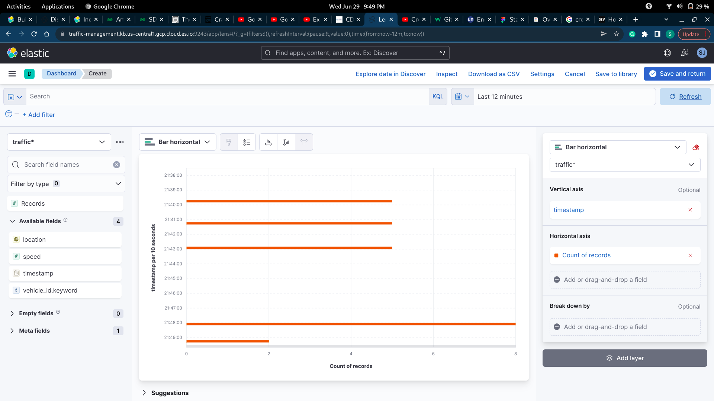
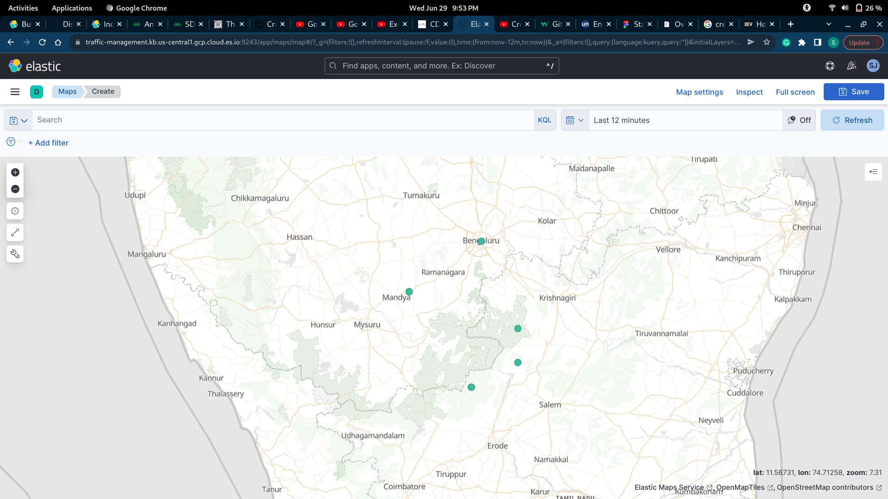
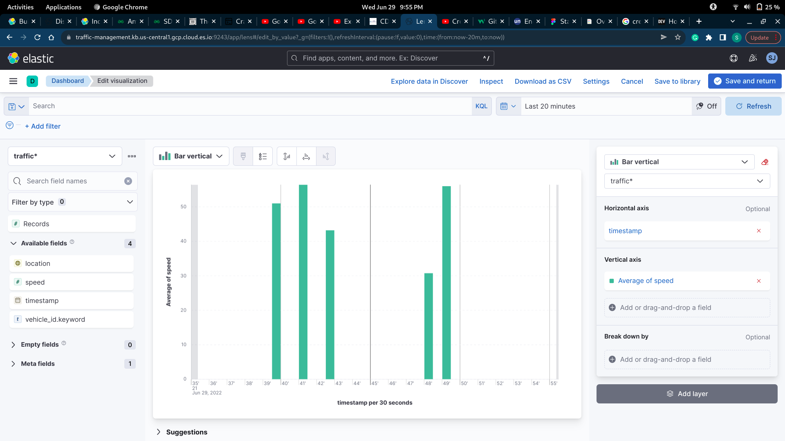
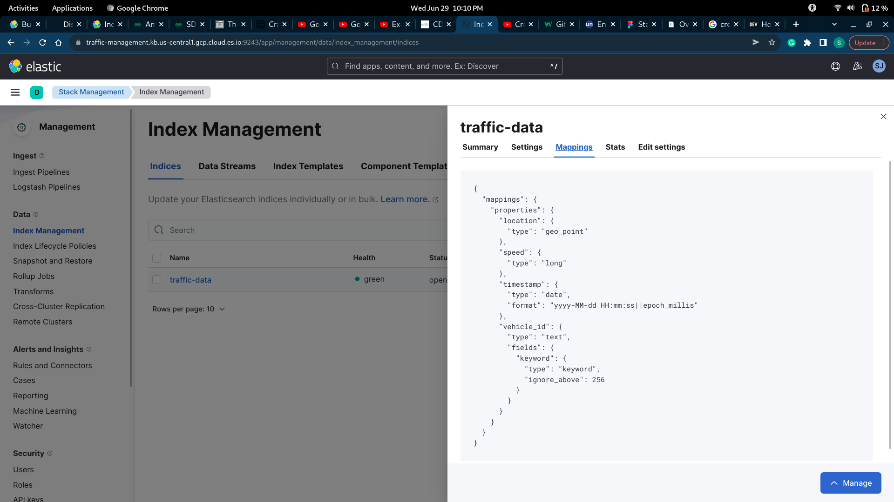

# IoT-pub-sub
Backend of the traffic management system based on publisher and subscribers model

## Traffic data analysis 
traffic data

Geographic points with high traffic volumes

Average speed of vehicles

traffic data structur

